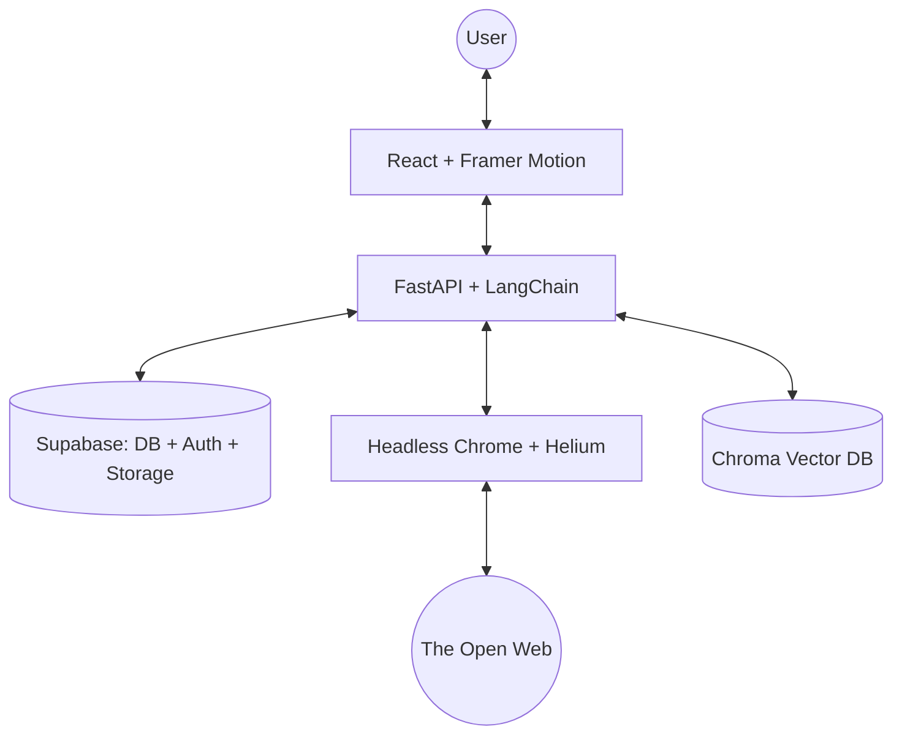

# 🌌 LAVEN: The Autonomous Portfolio Agent

**LAVEN** is not just a chatbot; it is a sophisticated, autonomous portfolio agent designed to bridge the gap between static resumes and interactive intelligence. From deep-web research to complex PDF analysis, LAVEN represents the evolution of personal branding in the AI era.

---

## 🚀 The Journey: From Script to Agency

The creation of LAVEN was an iterative odyssey of technical hardening and design refinement:

1.  **The Spark (Local Origins)**: 
    Started as a simple FastAPI wrapper with local session management. It could chat, but lived purely within the confines of a single terminal session.
2.  **Cognitive Expansion (RAG & Search)**: 
    Integrated **LangChain** and **Chroma DB** to allow the agent to read PDFs (like resumes and project docs) and perform basic web searches via DuckDuckGo.
3.  **The Leap to Agency (Helium Integration)**: 
    The turning point. We empowered LAVEN with **Helium**, allowing it to open a real Chrome browser, click buttons, scroll pages, and conduct research just like a human. It transitioned from "searching" to "browsing."
4.  **Persistence & Scale (Supabase Migration)**: 
    To move beyond local development, we architected a cloud-native backend. **Supabase** became the backbone for PostgreSQL database (chat history), JWT Authentication, and Storage (multimodal assets).
5.  **Production Hardening (Render & Memory)**: 
    Deployed on **Render**. Overcame significant OOM (Out of Memory) challenges by implementing lazy hydration of sessions and optimizing headless browser performance for cloud-tier constraints.
6.  **Visual Renaissance**: 
    The frontend was transformed into a premium experience. Using **Framer Motion 12**, **TSParticles**, and glassmorphic design principles, we created an interface that feels alive—featuring animated characters and dynamic beam backgrounds.

---

## 🛠️ Core Capabilities

LAVEN is equipped with a powerhouse of tools that make it a truly "agentic" experience:

### 🔍 Autonomous Web Research (Desktop Optimized)
- **Browser Control**: Uses Helium/Selenium to navigate complex websites.
- **Smart Navigation**: Can click links, go back, and scroll to find the most relevant information.
- **CAPTCHA Resilience**: Automatically switches search engines (Google → DuckDuckGo) when encountering blocks.
- **Result Scoring**: Implements custom heuristic scoring to filter out web clutter and extract "Direct Insights."
- **Note**: This feature is specifically optimized for Desktop environments for maximum performance and visibility.

### 📄 Intelligent Document Processing
- **PDF RAG**: High-fidelity PDF indexing using `all-MiniLM-L6-v2` embeddings.
- **Schema-Aware**: Reads CSV, Excel, and JSON files to analyze data structures on the fly.
- **Context Isolation**: Each chat thread maintains its own vector database instance for maximum privacy and accuracy.

### 🖼️ Multimodal Vision
- **Image Analysis**: Upload images directly to the chat for real-time analysis and feedback.
- **Supabase Storage**: Secure, fast delivery of multimodal content via global buckets.

### 🔐 Secure & Persistent Memory
- **JWT Auth**: Full user authentication flow integrated with Supabase.
- **Lazy Restoration**: Threads are re-hydrated from the database only when needed, preserving server memory.
- **Thread Management**: Create, rename, delete, and save chat sessions with a persistent dashboard.

---

## 🏗️ Technical Architecture

---

## 🎨 Design Aesthetics

LAVEN's UI is built on three pillars:
- **Glassmorphism**: A sleek, frosted-glass look that feels modern and lightweight.
- **Fluid Motion**: Powered by Framer Motion, every transition (from login to chat) is silky smooth.
- **Interactive Backgrounds**: Dynamic "Beam" and "Particle" effects that react to user presence.

---

## 📦 Getting Started

### Backend Setup
1. `cd backend`
2. `pip install -r requirements.txt`
3. Create a `.env` with your `SUPABASE_URL`, `SUPABASE_KEY`, and `GROQ_API_KEY` (or other LLM keys).
4. Run: `uvicorn main:app --reload`

### Frontend Setup
1. `cd frontend`
2. `npm install`
3. Create a `.env` with `REACT_APP_SUPABASE_URL` and `REACT_APP_SUPABASE_ANON_KEY`.
4. Run: `npm start`

---

## 🌟 Acknowledgments
Special thanks to the open-source communities behind LangChain, FastAPI, Helium, and Framer Motion for providing the building blocks of this autonomous future.

**Created with ❤️ by [Thakur Dash](https://github.com/ThakurDash24)**
