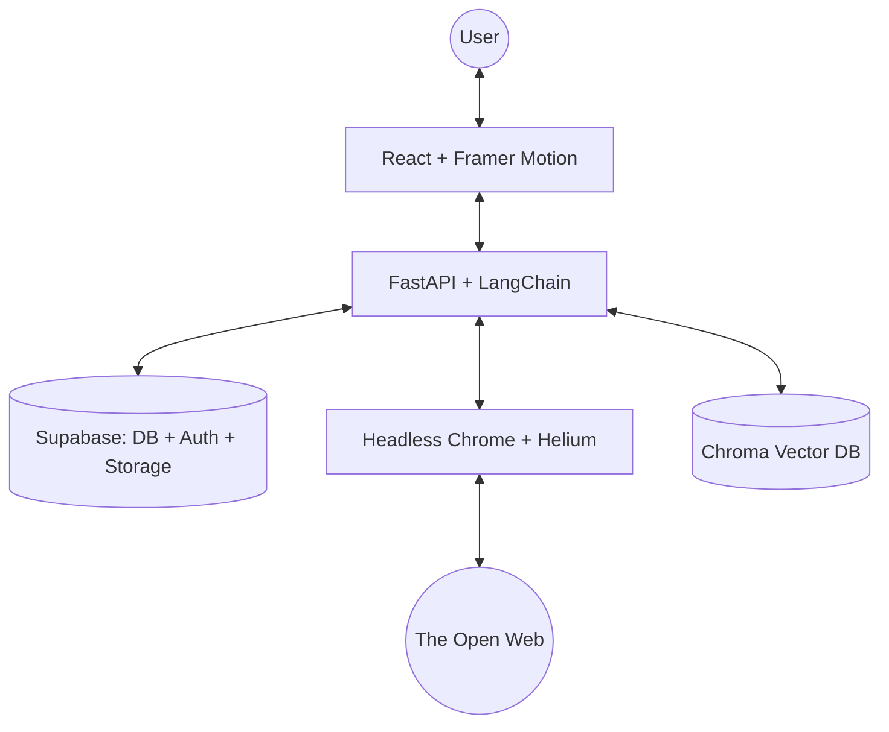

# 🌌 LAVEN: The Autonomous Portfolio Agent

[](https://portfolio-agent-xvgo.onrender.com)
[](https://github.com/ThakurDash24/Portfolio-Agent)

**LAVEN** is a sophisticated, autonomous portfolio agent designed to bridge the gap between static resumes and interactive intelligence. From deep-web research to complex PDF analysis and Multimodal Vision capabilities, LAVEN represents the evolution of personal branding in the AI era.

This guide is designed for **freshers and new developers** to understand the architecture, setup the project locally, and explore the core implementations of this service.

---

## 🏗️ Project Architecture

The project is split into two main directories:

1. **`frontend/`**: A modern React application built with Framer Motion, TailwindCSS, and TSParticles for a highly interactive, glassmorphic UI.
2. **`backend/`**: A robust FastAPI python server that orchestrates the AI agent (LangChain + LiteLLM), handles vector databases (ChromaDB), and manages headless browsing (Helium/Selenium).


```mermaid
graph TD
    User((User)) <--> Frontend[React + Framer Motion]
    Frontend <--> Backend[FastAPI + LangChain]
    Backend <--> Supabase[(Supabase: DB + Auth + Storage)]
    Backend <--> Chrome[Headless Chrome + Helium]
    Backend <--> VectorStore[(Chroma Vector DB)]
    Chrome <--> Internet((The Open Web))
```

---

## 🚀 Multimodal Capabilities & Where to Find Them

One of the standout features of LAVEN is its **Multimodal Vision** and **Document Processing** capabilities. It can process images, PDFs, and understand complex queries combining both text and visual context.

### 1. Image Vision Processing
The agent can analyze uploaded images using vision-capable LLMs (like `meta-llama/llama-4-scout-17b-16e-instruct`).

*   **API Endpoint:** The image upload is handled in `backend/main.py` under the `@app.post("/upload/image")` route (around line 325). It securely uploads the image to Supabase Storage and returns a public URL.
*   **Agent Logic:** The core multimodal logic resides in `backend/app/__init__.py`. 
    *   In the `_prepare_messages` method (around line 94), the agent checks for images and formats the payload for Vision models.
    *   In the `__call__` method (around line 307), the agent dynamically switches its model to `meta-llama/llama-4-scout-17b-16e-instruct` when an image is present in the request, ensuring the request is routed to a vision-capable engine.

### 2. Intelligent PDF Document Processing (RAG)
LAVEN can read, chunk, and embed PDF files to answer context-specific questions.

*   **API Endpoint:** The PDF upload is handled in `backend/main.py` under the `@app.post("/upload/pdf")` route (around line 361).
*   **Vectorization Logic:** The actual extraction and ChromaDB indexing happen in `backend/tools.py` via the `init_pdf_vectorstore` function (around line 30). This function uses `PyPDFLoader` to extract text and `HuggingFaceEmbeddings` (`all-MiniLM-L6-v2`) to create vector embeddings.

---

## 🛠️ Additional Core Implementations

*   **Autonomous Web Browsing:** The agent can spawn a headless Chrome browser to search the web, click links, and bypass simple CAPTCHAs. Implemented in `backend/tools.py` using `Helium` and `Selenium` (`browser_search_tool` and `browser_click_tool`).
*   **Guest Mode & Chat Persistence:** Chat sessions are persistently saved to a Supabase PostgreSQL database. `backend/main.py` handles the logic to lazily restore chat history when a user reconnects.

---

## 📦 Step-by-Step Setup Guide for Freshers

### Prerequisites
*   Node.js (v18+)
*   Python 3.9+
*   A Supabase Account (for Database, Auth, and Storage)
*   API Keys: GROQ API Key (for the LLM).

### 1. Backend Setup (FastAPI)

1.  **Navigate to the backend directory:**
    ```bash
    cd backend
    ```
2.  **Create and activate a virtual environment:**
    *   Windows: `python -m venv venv` and then `.\venv\Scripts\activate`
    *   Mac/Linux: `python3 -m venv venv` and then `source venv/bin/activate`
3.  **Install Dependencies:**
    ```bash
    pip install -r requirements.txt
    ```
4.  **Environment Variables:** Create a `.env` file in the `backend` folder:
    ```env
    SUPABASE_URL=your_supabase_project_url
    SUPABASE_KEY=your_supabase_service_role_key
    GROQ_API_KEY=your_groq_api_key
    CORS_ORIGINS=http://localhost:3000
    ```
5.  **Run the Server:**
    ```bash
    uvicorn main:app --host 0.0.0.0 --port 8000 --reload
    ```
    *The backend will be live at `http://localhost:8000`.*

### 2. Frontend Setup (React)

1.  **Navigate to the frontend directory:**
    ```bash
    cd frontend
    ```
2.  **Install Node Modules:**
    ```bash
    npm install
    ```
3.  **Environment Variables:** Create a `.env` file in the `frontend` folder:
    ```env
    REACT_APP_SUPABASE_URL=your_supabase_project_url
    REACT_APP_SUPABASE_ANON_KEY=your_supabase_anon_key
    ```
4.  **Start the Development Server:**
    ```bash
    npm start
    ```
    *The frontend will be live at `http://localhost:3000`.*

---

## 🎨 Design Aesthetics
LAVEN's UI relies on:
- **Glassmorphism**: A sleek, frosted-glass look.
- **Fluid Motion**: Powered by `Framer Motion`.
- **Interactive Backgrounds**: Dynamic effects powered by `@tsparticles/react`.

Enjoy building and extending LAVEN!
